# CLAUDE.md

This file provides guidance to Claude Code (claude.ai/code) when working with code in this repository.

## Project Overview

Full-stack DAO voting application with gasless transactions (meta-transactions via EIP-2771).

## Project Structure

- **sc/**: Smart contracts built with Foundry (Solidity)
- **web/**: Frontend built with Next.js 15, React 19, TypeScript, and Tailwind CSS v4

## Smart Contract Architecture

### Core Contracts

1. **DAO Voting Contract** (extends ERC2771Context)
   - Manages numbered proposals (1, 2, 3...)
   - Each proposal contains:
     - Proposal ID (sequential: 1, 2, 3...)
     - Funds amount (ETH)
     - Recipient address
     - Voting deadline timestamp
     - Vote statistics: positive votes, negative votes, abstentions
     - Execution status
   - Voting requirements:
     - Users must hold minimum balance (token/ETH) to vote
     - One vote per user per proposal
     - Votes: FOR (positive), AGAINST (negative), ABSTAIN
   - Execution logic:
     - When voting deadline passes and positive votes > negative votes
     - After additional time delay, proposal auto-executes
     - Transfers proposal funds to recipient
   - Fund management:
     - Accepts additional funding via payable functions
     - Tracks total DAO treasury balance

2. **MinimalForwarder** (EIP-2771 implementation)
   - Relayer contract enabling gasless transactions
   - Validates meta-transaction signatures
   - Forwards calls to trusted target contracts
   - Implements nonce tracking to prevent replay attacks

### Meta-Transaction Flow (Gasless Voting)

1. User creates vote transaction and signs it off-chain (no gas required)
2. Web app acts as relayer, receives signed message
3. Relayer submits meta-transaction to MinimalForwarder (pays gas)
4. MinimalForwarder validates signature and forwards to DAO contract
5. DAO contract (via ERC2771Context) extracts original sender from calldata
6. Vote is recorded with original user's address

## Smart Contract Development (sc/)

### Commands

Build contracts:
```bash
forge build
```

Run all tests:
```bash
forge test
```

Run tests with verbosity (useful for debugging):
```bash
forge test -vvv  # Execution traces for failing tests
forge test -vvvv # Execution traces for all tests
```

Run a specific test file:
```bash
forge test --match-path test/YourTest.t.sol
```

Run a specific test function:
```bash
forge test --match-test testFunctionName
```

Format code:
```bash
forge fmt
```

Generate gas snapshots:
```bash
forge snapshot
```

Start local Ethereum node:
```bash
anvil
```

Deploy contracts:
```bash
forge script script/YourScript.s.sol:YourScript --rpc-url <rpc_url> --private-key <private_key>
```

### Structure

- **src/**: Solidity source contracts
- **test/**: Test files (*.t.sol)
- **script/**: Deployment scripts (*.s.sol)
- **lib/**: Dependencies (managed by Foundry)
- **foundry.toml**: Foundry configuration

## Frontend Development (web/)

### Features

1. **MetaMask Integration**
   - Connect user wallet to interact with DAO
   - Display connected account and balance

2. **Funding**
   - Transfer ETH to DAO contract (required to participate in voting)
   - View user's balance in the DAO contract

3. **Proposal Creation**
   - Only users with ≥10% of DAO contract balance can create proposals
   - Proposal includes: recipient address, ETH amount, voting deadline

4. **Proposal Listing**
   - Display all proposals with their current state
   - Show proposal details: ID, recipient, amount, deadline, vote statistics

5. **Voting**
   - Vote on proposals (FOR, AGAINST, ABSTAIN)
   - Change vote until voting deadline
   - Voting uses gasless meta-transactions via relayer
   - View real-time vote statistics per proposal

6. **Proposal Execution**
   - Background daemon monitors approved proposals
   - Auto-executes fund transfer when:
     - Voting deadline passed
     - Positive votes > negative votes
     - Execution delay period elapsed

### Relayer Configuration

The web app includes a built-in relayer that pays gas for user votes:

**Environment Variables (.env.local):**
```
RELAYER_ADDRESS=0x...
RELAYER_PRIVATE_KEY=0x...
FORWARDER_CONTRACT_ADDRESS=0x...  # MinimalForwarder (EIP-2771)
DAO_CONTRACT_ADDRESS=0x...
```

### Architecture

- **Relayer service**: Backend API route handling meta-transaction submission
- **Daemon**: Background process checking for executable proposals
- **Web3 integration**: ethers.js for blockchain interaction
- **State management**: Track proposals, votes, user balance

### Commands

All commands should be run from the `web/` directory.

Start development server:
```bash
npm run dev
```

Build for production:
```bash
npm run build
```

Start production server:
```bash
npm start
```

Run linter:
```bash
npm run lint
```

### Structure

- **src/app/**: Next.js App Router pages and layouts
- **src/app/api/**: API routes (relayer endpoint)
- **src/lib/**: Utilities, contract ABIs, web3 helpers
- **src/components/**: React components
- **public/**: Static assets

### Tech Stack

- Next.js 15 with App Router and Turbopack
- React 19
- TypeScript 5
- Tailwind CSS v4
- Web3 library (ethers.js)
- MetaMask integration

Development server runs on http://localhost:3000 by default.

```mermaid

   graph TB
      subgraph "Frontend (Next.js 15)"
         User[👤 Usuario]
         MetaMask[🦊 MetaMask Wallet]
         UI[Interface Web]
         Relayer[⚡ Relayer Service<br/>API Route]
         Daemon[🤖 Daemon<br/>Monitor de Propuestas]
      end

      subgraph "Smart Contracts (Foundry)"
         Forwarder[📮 MinimalForwarder<br/>EIP-2771]
         DAO[🏛️ DAO Voting Contract<br/>ERC2771Context]
         Treasury[(💰 Treasury<br/>Fondos ETH)]
      end

      subgraph "Flujo Gasless (Meta-Transacción)"
         Sign[1️⃣ Firma Mensaje<br/>Off-chain]
         Submit[2️⃣ Envía Firma<br/>al Relayer]
         Validate[3️⃣ Valida Firma<br/>y Nonce]
         Forward[4️⃣ Forward Call<br/>+ Paga Gas]
         Extract[5️⃣ Extrae Sender<br/>Original]
         Record[6️⃣ Registra Voto]
      end

      subgraph "Propuesta"
         P[📋 Proposal]
         P --> PID[ID Secuencial]
         P --> Amount[Monto ETH]
         P --> Recipient[Dirección Destino]
         P --> Deadline[Fecha Límite]
         P --> Votes[Votos: FOR/AGAINST/ABSTAIN]
         P --> Status[Estado Ejecución]
      end

      %% Conexiones principales
      User -->|Conecta| MetaMask
      MetaMask -->|Firma| UI
      
      %% Flujo de votación
      User -->|Crea Voto| Sign
      Sign -->|Mensaje Firmado| Submit
      Submit -->|POST Request| Relayer
      Relayer -->|Envía Tx| Validate
      Validate -->|Verifica| Forwarder
      Forwarder -->|Llama| Forward
      Forward -->|msg.sender original| Extract
      Extract -->|Registra| DAO
      DAO -->|Almacena| Record
      
      %% Propuestas
      User -->|Crea Propuesta<br/>≥10% balance| DAO
      DAO -->|Gestiona| P
      UI -->|Muestra| P
      
      %% Ejecución automática
      Daemon -->|Monitorea| DAO
      DAO -->|Deadline + Aprobada| Daemon
      Daemon -->|Auto-ejecuta| DAO
      DAO -->|Transfiere| Treasury
      Treasury -->|ETH| Recipient
      
      %% Funding
      User -->|Deposita ETH| Treasury
      Treasury -.->|Balance mínimo<br/>para votar| User

      style User fill:#e1f5ff
      style MetaMask fill:#f6851b,color:#fff
      style Relayer fill:#10b981,color:#fff
      style Forwarder fill:#8b5cf6,color:#fff
      style DAO fill:#3b82f6,color:#fff
      style Treasury fill:#fbbf24
      style Daemon fill:#ec4899,color:#fff
      style Sign fill:#ddd
      style Submit fill:#ddd
      style Validate fill:#ddd
      style Forward fill:#ddd
      style Extract fill:#ddd
      style Record fill:#ddd
```


